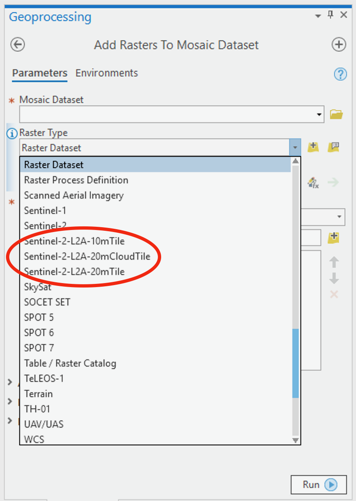

# Sentinel2-raster_types
The project defines new raster types in ArcGIS Pro to enable to read and load Sentinel-2 L2A product tiles available for free at [Amazon S3]( https://registry.opendata.aws/sentinel-2/).

Sentinel-2 satellites sense visible and infrared spectrum in 12 bands. Rasters that are processed by the pipeline are available in 2 products L1C - top of the atmosphere and L2A - bottom of the atmosphere. These raster products are called granules available at no cost to download from Amazon S3.[See Open Data on AWS] (https://registry.opendata.aws/sentinel-2/) Only data transfer costs from AWS S3 to you computer have to be payed, few cents per GB.

The granules are also cut to 100x100km tiles according to the military grid ([kml](https://sentinel.esa.int/documents/247904/1955685/S2A_OPER_GIP_TILPAR_MPC__20151209T095117_V20150622T000000_21000101T000000_B00.kml)) which is very handy and easy to work with.


> For Level-1C and Level-2A, the granules, also called tiles, are 100x100 km2 ortho-images in UTM/WGS84 projection. Download the Sentinel-2 tiling grid kml. The UTM (Universal Transverse Mercator) system divides the Earth's surface into 60 zones. Each UTM zone has a vertical width of 6° of longitude and horizontal width of 8° of latitude. [Further Details](https://sentinel.esa.int/web/sentinel/missions/sentinel-2/data-products)

The raster storage on Amazon S3 is organized to a file system structure with metadata and images for every band in separate files. This Sentinel-2 raster type allows you to read the file structure and load the rasters to mosaic dataset in ArcGIS Pro. 3 new raster products become available after installation
- *Sentinel-2-L2A-10mTile* which is a 4-band raster (red, green, blue and near infrared) with 10m/px resolution
- *Sentinel-2-L2A-20mTile* which is a 9-band raster with 20m/px resolution
- *Sentinel-2-L2A-20mTileCloud * which is a 10-band raster with 20m/px resolution, similar to Sentinel-2-L2A-20mTile with additional cloud mast raster band B00.
These multiband rasters are created from R10m, R20m source image folders and their content.
*Acquisition Date*, *Cloud Coverage* and *Vegetation Percentage* attributes are also added to filter resulting rasters.


### Instalation
To install create a new directory under 
`C:\Program Files\ArcGIS\Pro\Resources\Raster\Types\System\`
named *Sentinel-2-Tile* and copy the python files and raster function templates defined in `*.rft.xml` files to the directory.
After restarting ArcGIS Pro new raster types will become available in the *Add Rasters to Mosaic Dataset* geoprocessing tool.
Tested under ArcGIS Pro 2.2 and 2.3.



### Loading tiles
You can use standard geoprocessing tools, e.g. *Add Rasters to Mosaic Dataset*, to load the rasters to a mosaic dataset. However, I provide also sample script (*SentinelImporter.py*) that can help you to create the mosaic dataset and load all tiles from a directory (recursive).

To create a mosaic dataset for your imaginery just call (just take care of the spatial reference)
```SentinelImporter.createMosaicDataset(workspace, "mosaic_dataset_name", "10m", arcpy.SpatialReference(32634))```

Use `10m`, `20m` or `20c` to specify the raster type Sentinel-2-L2A-10mTile, Sentinel-2-L2A-20mTile or Sentinel-2-L2A-20m CloudMask respectively for the mosaic dataset.

To import all tiles in a directory and its subdirectories, call 
```SentinelImporter.importTiles("E:/Sentinel_tiles_from_amazonS3/", "E:/Sentinel2.gdb/mosaic_dataset_name", "10m")```

Additionaly the script can generate also a cloud mask featureclass by parsing *qi/MSK_CLOUDS_B00.gml* file.
Just have a look on the script code. It's only 3 lines altogether...

```
    # create tile mask featureClass
    cloudmask_featureclass = CloudMask.createFeatureClass(workspace, "CloudMask", arcpy.SpatialReference(32634))

    # create mosaic dataset
    mosaic_dataset = SentinelImporter.createMosaicDataset(workspace, "S2-10m", "10m", arcpy.SpatialReference(32634))

    # load rasters
    loadedRasters = SentinelImporter.importTiles("E:/Sentinel_tiles_from_amazonS3/", mosaic_dataset, "10m", cloudmask_featureclass)
```
